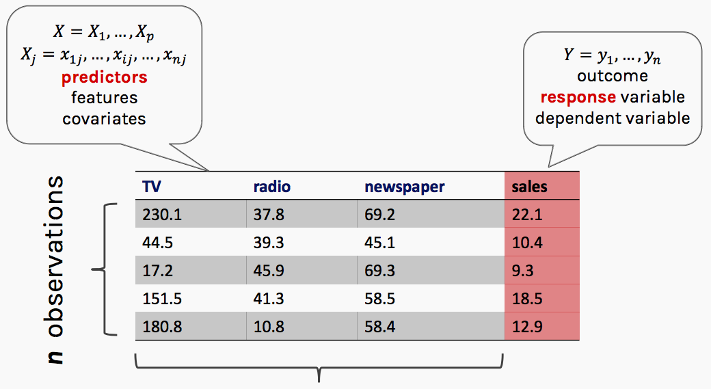
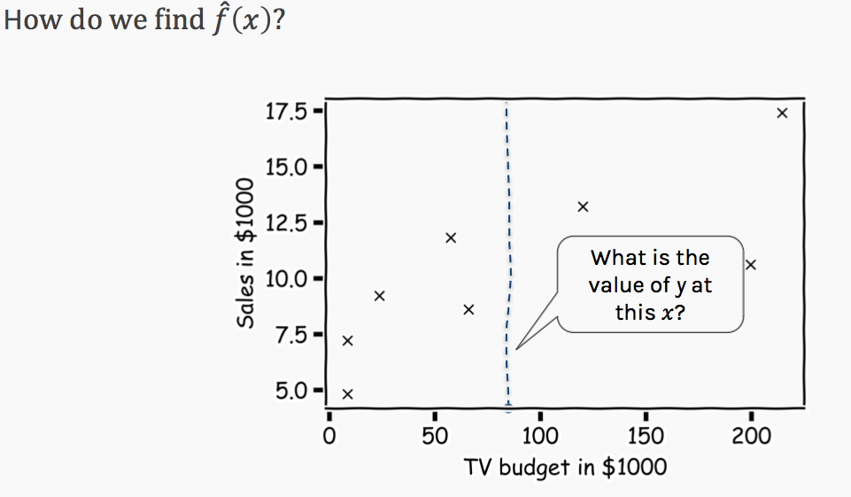
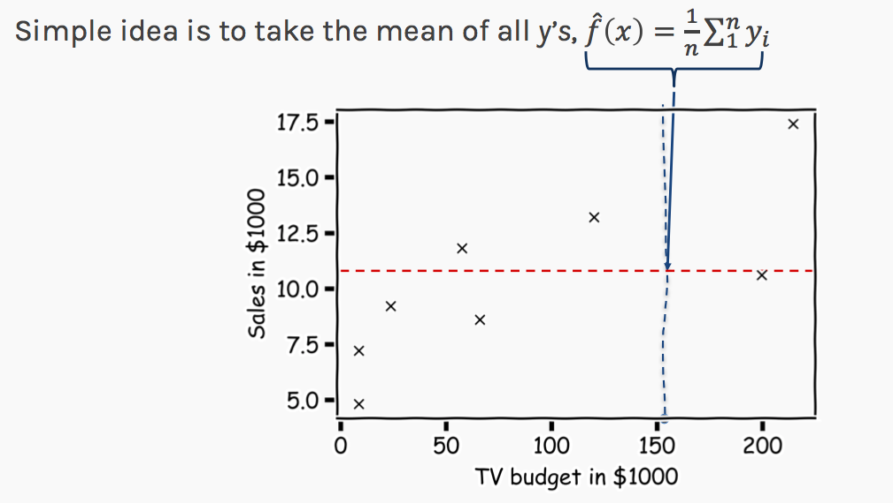
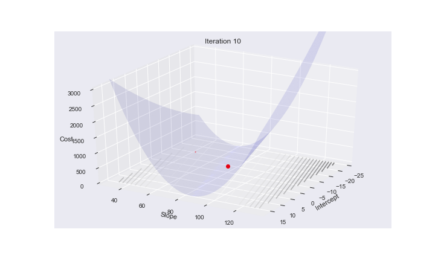
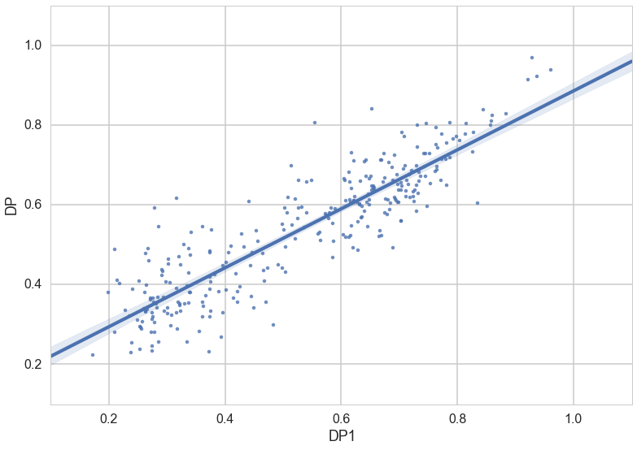
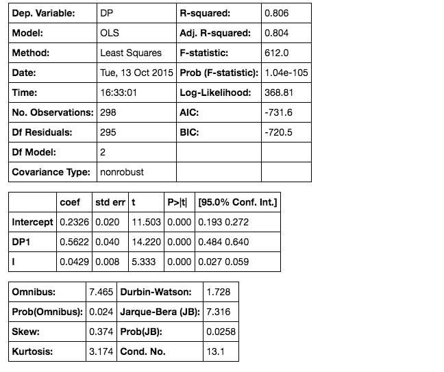
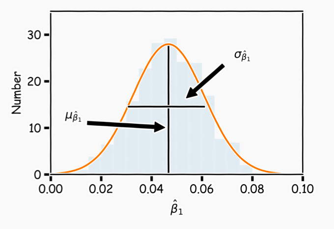
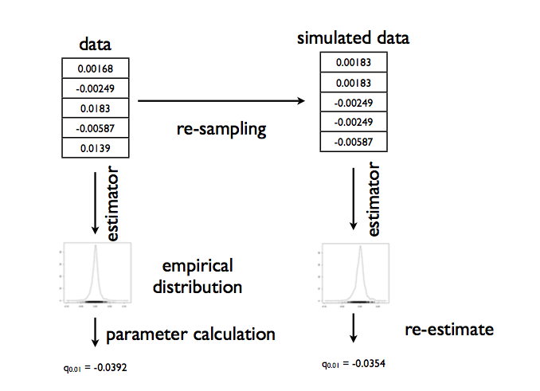
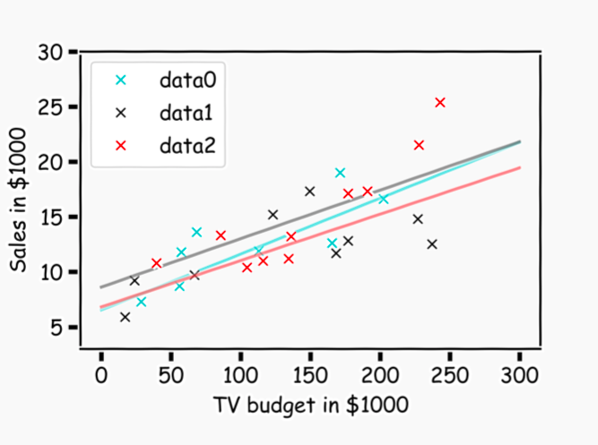
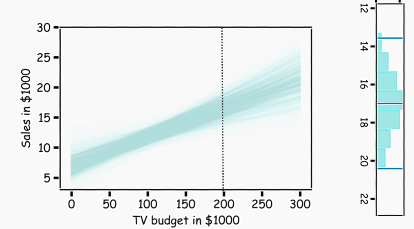

footer:
autoscale: true


---

#[fit] Ai 1

---

#[fit] Regression

---

## Topics we will cover

1. What is $$x$$, $$f$$, $$y$$, and that damned hat?
2. The simplest models and evaluating them
3. Frequentist Statistics
4. Noise and Sampling
5. Bootstrap
6. Prediction is more uncertain than the mean

---

- how many dollars will you spend?
- what is your creditworthiness
- how many people will vote for Bernie t days before election
- use to predict probabilities for classification
- causal modeling in econometrics


---

## Dataset: Sales and Ad spending


---

##[fit] 1. What are $$x$$, $$f$$, $$y$$?
## and those 
##[fit] damned hats $$\hat{f}$$, $$\hat{y}$$ ?

---



---

## Two Questions



---

## True vs Statistical Model

We will assume that the measured response variable, $$y$$, relates to the predictors, $$x$$, through some unknown function expressed generally as:

$$y = f(x) + \epsilon$$

Here, $$f$$ is the unknown function expressing an underlying rule for relating $$y$$ to $$x$$, and $$\epsilon$$ is a random amount (unrelated to $$x$$) that $$y$$ differs from the rule $$f(x)$$.

In real life we never know the true generating model $$f(x)$$

---

## The best we can do..is to estimate $$f(x)$$.

A statistical model is any algorithm that estimates $$f$$. We denote the estimated function as $$\hat{f}$$.

There are two reasons for this:

1. We have no idea about the true generating process. So the function we use (we'll sometimes call this $$g$$) may have no relation to the real function that generated the data.
2. We only have access to a sample, with reality denying us access to the population.

We shall use the notation $$\hat{f}$$ to incorporate both of these considerations.

---

##[fit] 2. The Simplest Models 
##[fit] Fitting and evaluating them

---

## Possibly the simplest model: the mean



---

## The next simplest: fit a straight line


How? Use the **Mean Squared Error**:

$$MSE = \frac{1}{N}\sum_i (\hat{y}_i - y_i)^2$$

Minimize this with respect to the *parameters*. (Here the intercept and slope)

---

## Gradient Descent: Minimize Squared Error

basically go opposite the direction of the derivative.

Consider the objective function: $$ J(x) = x^2-6x+5 $$

```python
gradient = fprime(old_x)
move = gradient * step
current_x = old_x - move
```


---

## Gradient Descent for LR

CONVEX: $$\theta_j := \theta_j + \alpha \sum_{i=1}^m (y^{(i)}-f_\theta (x^{(i)})) x_j^{(i)}$$




---

## What value of the mean squared error is a good one?

The value of the MSE depends on the units of y. 

So eliminate dependence on units of y.

$$R^2 = 1 - \frac{\sum_i (\hat{y}_i - y_i)^2}{\sum_i (\bar{y} - y_i)^2}$$


---

## Evaluation

$$R^2 = 1 - \frac{\sum_i (\hat{y}_i - y_i)^2}{\sum_i (\bar{y} - y_i)^2}$$

- If our model is as good as the mean value $$\bar{y}$$, then $$R^2 = 0$$.
- If our model is perfect then $$R^2 = 1$$.
- $$R^2$$ can be negative if the model is worst than the average. This can happen when we evaluate the model on the test set.

---

##[fit] 3. Frequentist Statistics 

---

## Answers the question: 

**What is Data?** 

with

>"data is a **sample** from an existing **population**"

- data is stochastic, variable
- model the sample. The model may have parameters
- find parameters for our sample. The parameters are considered **FIXED**.

---

## Likelihood

How likely it is to observe values $$x_1,...,x_n$$ given the parameters $$\lambda$$?

$$
L(\lambda) = \prod_{i=1}^n P(x_i | \lambda)
$$

How likely are the observations if the model is true?

---

## Maximum Likelihood estimation


---


---

## Gaussian Distribution assumption

$$\renewcommand{\v}[1]{\mathbf #1}$$
Each $$y_i$$ is gaussian distributed with mean  $$\mathbf{w}\cdot\mathbf{x}_i$$ (the y predicted by the regression line) and variance $$\sigma^2$$:


$$
\renewcommand{\v}[1]{\mathbf #1}
y_i \sim N(\v{w}\cdot\v{x_i}, \sigma^2) .$$

$$N(\mu, \sigma^2) = \frac{1}{\sigma\sqrt{2\pi}} e^{-(y - \mu)^2 / 2\sigma^2},$$

---

We can then write the likelihood:

$$
\renewcommand{\v}[1]{\mathbf #1}
\cal{L} = p(\v{y} | \v{x}, \v{w}, \sigma) = \prod_i p(\v{y}_i | \v{x}_i, \v{w}, \sigma)$$


$$\renewcommand{\v}[1]{\mathbf #1}
\cal{L} =  (2\pi\sigma^2)^{(-n/2)} e^{\frac{-1}{2\sigma^2} \sum_i (y_i -  \v{w}\cdot\v{x}_i)^2} .$$

The log likelihood $$\ell$$ then is given by:

$$\renewcommand{\v}[1]{\mathbf #1}
\ell = \frac{-n}{2} log(2\pi\sigma^2) - \frac{1}{2\sigma^2}  \sum_i (y_i -  \v{w}\cdot\v{x}_i)^2 .$$

---

## Maximizing gives:

$$\renewcommand{\v}[1]{\mathbf #1}
\v{w}_{MLE} = (\v{X}^T\v{X})^{-1} \v{X}^T\v{y}, $$

where we stack rows to get:

$$\renewcommand{\v}[1]{\mathbf #1}
\v{X} =  stack(\{\v{x}_i\})$$

$$\renewcommand{\v}[1]{\mathbf #1}
\sigma^2_{MLE} =  \frac{1}{n} \sum_i (y_i -  \v{w}\cdot\v{x}_i)^2  . $$

---

## Or minimize

## The negative log likelihood using gradient descent

## Minimize the Cost, Risk, Loss

---

## Example: House Elections



---



`Dem_Perc(t) ~ Dem_Perc(t-2) + I`

- done in statsmodels
- From Gelman and Hwang

---

##[fit] 4. Noise and Sampling

---

## Regression Noise Sources

- lack of knowledge of the true generating process
- sampling
- measurement error or irreducible error $$\epsilon$$.
- lack of knowledge of $$x$$

---


We will first address $$\epsilon$$

Predictions made with the "true" function $$f$$ will not match observed values of y. 

Because of $$\epsilon$$, every time we measure the response y for a fixed value of x we
will obtain a different observation, and hence a different estimate of the weights.

But in real life we only measure $$y$$ once for a fixed value of $$x$$. In other words we have one sample!

---

## Magic Realism

Now, imagine that God gives you some M data sets **drawn** from the population. This is a hallucination, a magic realism..


---

## Multiple Fits

..and you can now find the regression on each such dataset (because you fit for the slope and intercept). So, we'd have M estimates of the slope and intercept.


---

## Sampling Distributions of parameters

As we let $$M \rightarrow \infty$$, the distributions induced on the slope and intercept are the empirical **sampling distribution of the parameters**.

We can use these sampling distribution to get confidence intervals on the parameters.

The variance of these distributions is called the **standard error**.

Here is an example: 



---

But we dont have M samples. What to do?

##[fit] 5. Bootstrap


---

## Bootstrap

- If we knew the true parameters of the population, we could generate M fake datasets.
- we dont, so we use our existing  data to generate the datasets
- this is called the Non-Parametric Bootstrap

Sample with replacement the $$x$$ from our original sample D, generating many fake datasets.

---




---

## M RESAMPLES of N data points


---

## Fitting lines to fake data

- We create fake datasets by resampling with replacement.
- Sampling with replacement allows more representative points in the data to show up more often
- we fit each such dataset with a line
- and do this M times where M is large
- these many regressions induce sampling distributions on the parameters



---



---

## Confidence Intervals on the "line"


- Each line is a rendering of $$\mu = a+bx$$, the mean value of the MLE Gaussian at each point $$x$$
- Thus the sampling distributions on the slope and intercept induce a sampling distribution on the lines
- And then the estimated $$\hat{f}$$ is taken to be the line with the mean parameters
  
---

## Sampling Distributions and Significance


---

Which parameters are important?

You dont want the parameters in a regression to be 0.

So, in a sense, you want parameters to have their sampling distributions as far away from 0 as possible.

Is this enough? Its certainly evocative.

But we must consider the "Null Hypothesis": a given parameter has no effect. We can do this by re-permuting just that column

---

##[fit] 6. Prediction is more uncertain ..
##[fit] than the mean

---

## Prediction vs Possible Prediction

- In machine learning we do not care too much about the functional form of our prediction $$\hat{y} = \hat{f}(x)$$, as long as we predict "well"
- Remember however our origin story for the data: the measured $$y$$ is assumed to have been a draw from a gaussian distribution at each x: this means that our prediction at an as yet not measured x should also be a draw from such a gaussian
- Still, we use the mean value of the gaussian as the value of the "prediction", but note that we can have many "predicted" data sets, all consistent with the original data we have

---


---

## From Likelihood to Predictive Distribution

- the band on the previous graph is the sampling distribution of the regression line, or a representation of the sampling distribution of the $$\mathbf{w}$$.
- $$p(y \vert \mathbf{x},  \mu_{MLE}, \sigma^2_{MLE})$$ is a probability distribution
- thought of as $$p(y^{*} \vert \mathbf{x}^*, \{ \mathbf{x}_i, y_i\},  \mu_{MLE}, \sigma^2_{MLE})$$, it is a predictive distribution for as yet unseen data $$y^{*}$$ at $$\mathbf{x}^{*}$$, or the sampling distribution for data, or the data-generating distribution, at the new covariates $$\mathbf{x}^{*}$$. This is a wider band.

---

## Mean vs Prediction


---

## Concepts to take away

- We see only one sample, and never know the "God Given" model. Thus we always make Hat estimates
- The simplest models are flat and sloped line. To fit these we use linear algebra or gradient descent.
- We use the $$R^2$$ to evaluate the models.
- Maximum Likelihood estimation or minimum loss estimation are used to find the best fit model
- Gradient Descent is one way to minimize the loss
   
---

## Concepts to take away, part 2

- Noise in regression models comes from model-lisspecification, measurement noise, and sampling
- sampling can be used to replicate most of these noise sources, and thus we can use a "magic realism" to study the impacts of noise
- in the absence of real samples we can construct fake ones using the bootstrap
- these samples can be used to understand the sampling variance of parameters and thus regression lines
- predictions are even more variant since our likelihood indicates a generative process involving sampling from a gaussian

---

## What's next?

- We'll look at more complex models, such as local regression using K-nearest-neighbors, and Polynomial Regression
- We'll use Polynomial Regression to understand the concepts of model complexity and overfitting
- We'll also see the use of validation sets to figure the value of hyperparameters
- We'll learn how to fit models using `sklearn`.